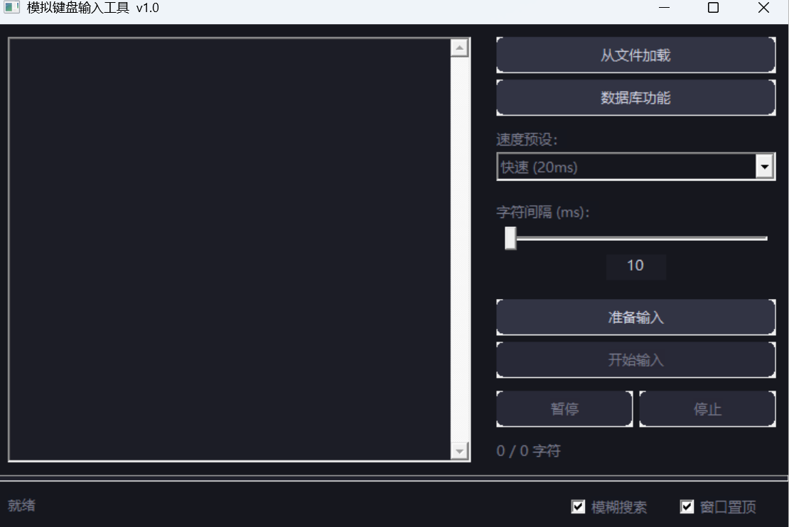
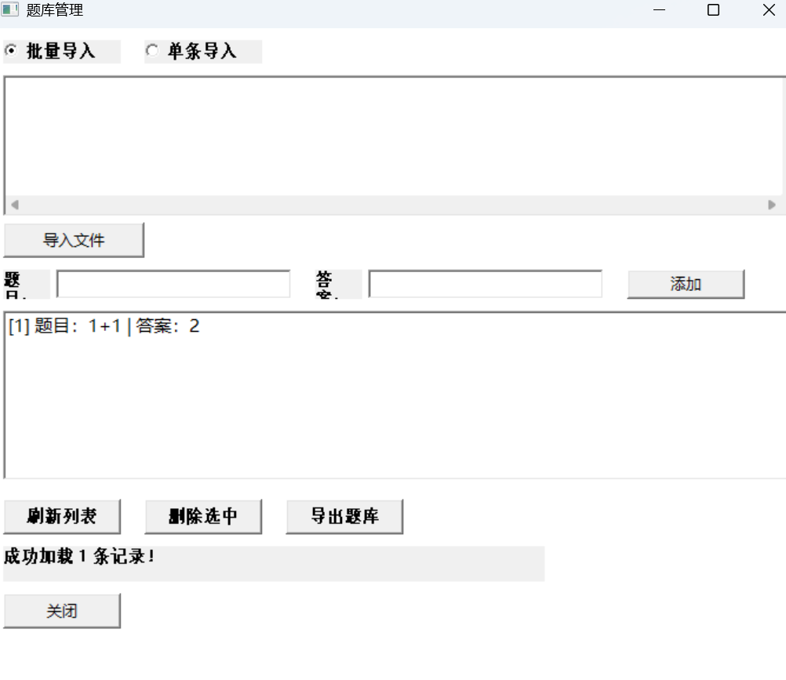

# BaoXiaoXin Writer (鲍小新写字)

> A tiny Win32 desktop tool that simulates keyboard input character-by-character — bypasses "paste disabled" restrictions everywhere. Full Unicode / Chinese support.

---

## Features

- **Simulate typing** — `SendInput + KEYEVENTF_UNICODE`, works in any app, full Unicode
- **Load from file** — `.txt` / `.md` / `.csv`, auto-detects UTF-8 / UTF-16 / UTF-16BE
- **Adjustable speed** — Slow (300ms) / Medium (80ms) / Fast (20ms) presets, or 10~500ms manual
- **Global hotkeys** — `Ctrl+Alt+V` start typing, `Ctrl+Alt+B` search answer, `Ctrl+Alt+S` stop
- **QA database** — Built-in SQLite-powered Q&A manager, fuzzy search supported
- **Fuzzy search** — Case-insensitive substring matching (toggle on/off in GUI)
- **Tray mode** — Minimizes to system tray; hotkeys work globally in background
- **Non-blocking** — Typing runs in a worker thread, UI stays responsive

## Screenshots





---

## Quick Start (Noob-Friendly)

### Step 1 — Download

Go to the [Releases](../../releases) page and download **both files** from the latest release:

| File | Why |
|------|-----|
| `KeyboardSim.exe` | The app itself |
| `sqlite3.dll` | Required for the QA database feature |

> **Put both files in the SAME folder.** If `sqlite3.dll` is missing, the database button won't work (typing still works fine).

Double-click `KeyboardSim.exe` to run. No installer needed.

### Step 2 — Type something (the easy way)

1. **Copy** any text to clipboard (Ctrl+C)
2. Press **`Ctrl+Alt+V`** — the app starts typing it into wherever your cursor is
3. To stop, press **`Ctrl+Alt+S`**

That's it. You don't even need to open the window.

### Step 3 — Open the window (if you want)

Right-click the tray icon → "打开主窗口". The window lets you:

- **From file**: load a `.txt` file into the text box
- **Speed**: adjust typing speed (slower = fewer rate-limit issues)
- **"从面板读取"** checkbox: check it → `Ctrl+Alt+V` reads from the text box instead of clipboard
- **QA Database**: search & manage Q&A pairs
- **Fuzzy search**: toggle on for inexact matching

### Step 4 — QA Database (clipboard search)

1. Copy a question to clipboard (Ctrl+C)
2. Press **`Ctrl+Alt+B`** — the app searches the database
3. **Window visible** → answer pasted into the text box
4. **Window hidden** → answer copied directly to your clipboard, ready to paste

---

## Hotkeys Summary

| Hotkey | Action |
|--------|--------|
| `Ctrl+Alt+V` | Start typing (clipboard or text box, depending on checkbox) |
| `Ctrl+Alt+B` | Search clipboard question in database |
| `Ctrl+Alt+S` | Stop typing immediately |

> **Admin rights**: Some programs (e.g. UAC prompts) require running this tool as administrator for SendInput to work.

---

## Build from Source

**Requires**: MinGW (gcc 6.3+)

```bat
git clone https://github.com/shenyuhao1/baoxiaoxin-writer.git
cd baoxiaoxin-writer
gcc -mwindows -O2 -s -o KeyboardSim.exe src/main.c src/ui.c src/worker.c src/database.c src/qa_ui.c src/config.c -lcomctl32 -luxtheme -lcomdlg32 -lgdi32 -lshell32
```

Output: `KeyboardSim.exe` (~58 KB). Requires `sqlite3.dll` at runtime for database features.

## Tech Stack

| Module | Implementation |
|--------|---------------|
| GUI | Win32 API + ComCtl32 v6 |
| Keyboard simulation | `SendInput` + `KEYEVENTF_UNICODE` |
| Unicode | Direct `wchar_t` injection, no IME |
| Threading | `_beginthreadex` + `CRITICAL_SECTION` + Event |
| Config | INI file (`%APPDATA%\KeyboardSim\config.ini`) |
| Database | SQLite (dynamic loading via `LoadLibrary`) |
| Build | MinGW gcc, pure C, zero third-party libs |

## License

MIT
